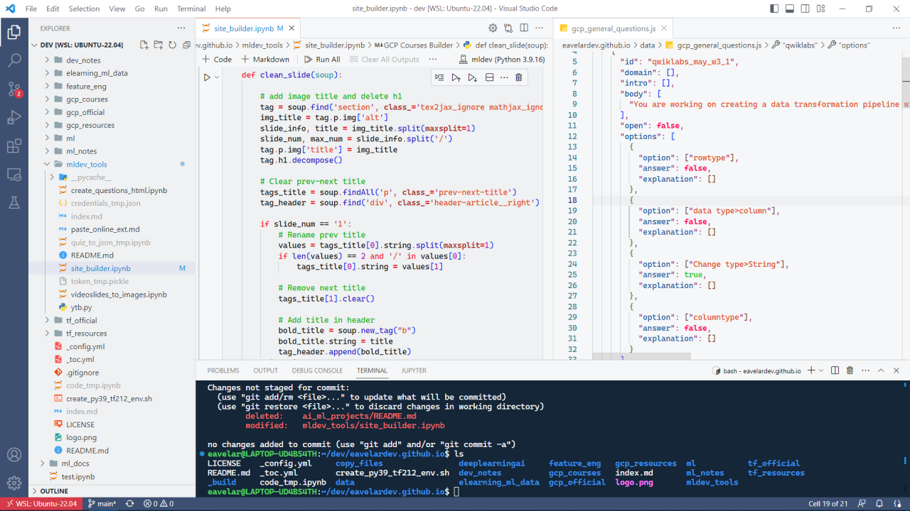

# My VS Code theme



Add this to your json config to use my personalized theme.

```json
{
    "editor.fontFamily": "'Cascadia Code', Consolas, monospace",
    "editor.fontSize": 13.2,
    "workbench.colorTheme": "Visual Studio Light",
    "workbench.colorCustomizations": {
        "[Visual Studio Light]": {
            "foreground": "#000000",
            "notebook.cellBorderColor": "#d0d7de",
            "focusBorder": "#00000000",
            "notebook.focusedCellBorder": "#3d5072",
            "notebook.focusedEditorBorder": "#d0d7de",

            // Monokai Light Theme
            "editor.background": "#F6F7F8",

            // GitHub Light Default
            "editor.lineHighlightBackground": "#eef0f1",

            "editorGroupHeader.tabsBackground": "#f6f8fa",
            "editorGroupHeader.tabsBorder": "#d0d7de",

            "gitDecoration.addedResourceForeground": "#448c27",
            "gitDecoration.conflictingResourceForeground": "#cd974b",
            "gitDecoration.deletedResourceForeground": "#f05050",
            "gitDecoration.ignoredResourceForeground": "#9f9f9f",
            "gitDecoration.modifiedResourceForeground": "#007acc",
            "gitDecoration.submoduleResourceForeground": "#7a3e9d",
            "gitDecoration.untrackedResourceForeground": "#448c27",

            "tab.activeBackground": "#fefefe",
            "tab.activeBorder": "#ffffff",
            "tab.activeBorderTop": "#fd8c73",
            "tab.activeForeground": "#24292f",
            "tab.border": "#d0d7de",
            "tab.hoverBackground": "#ffffff",
            "tab.inactiveBackground": "#f6f8fa",
            "tab.inactiveForeground": "#57606a",
            "tab.unfocusedActiveBorder": "#ffffff",
            "tab.unfocusedActiveBorderTop": "#d0d7de",
            "tab.unfocusedHoverBackground": "#eaeef280",

            "titleBar.activeBackground": "#ffffff",
            "titleBar.activeForeground": "#57606a",
            "titleBar.border": "#d0d7de",
            "titleBar.inactiveBackground": "#f6f8fa",
            "titleBar.inactiveForeground": "#57606a",

            // Geal
            "scrollbar.shadow": "#00000000",
            "scrollbarSlider.background": "#a6a6a64f",
            "scrollbarSlider.hoverBackground": "#a6a6a67a",

            "sideBar.background": "#f0f1f2",
            "sideBar.border": "#d0d7de",
            "sideBar.foreground": "#24292f",

            "activityBar.activeBackground": "#3d5072",
            "activityBar.background": "#3d5072",
            "statusBar.background": "#3d5072",

            // Github Light Theme
            "activityBarBadge.background": "#d73a49",
            "statusBarItem.remoteBackground": "#d73a49",

            // Primer
            "terminal.ansiBlack": "#000000",
            "terminal.ansiBlue": "#85e7fa",
            "terminal.ansiBrightBlack": "#686868",
            "terminal.ansiBrightBlue": "#3b8eea",
            "terminal.ansiBrightCyan": "#85e7ee",
            "terminal.ansiBrightGreen": "#56d364",
            "terminal.ansiBrightMagenta": "#ff77ff",
            "terminal.ansiBrightRed": "#f07178",
            "terminal.ansiBrightWhite": "#fafafa",
            "terminal.ansiBrightYellow": "#ffd864",
            "terminal.ansiCyan": "#85e7ee",
            "terminal.ansiGreen": "#3fb950",
            "terminal.ansiMagenta": "#ae90e9",
            "terminal.ansiRed": "#ff6c69",
            "terminal.ansiWhite": "#c7c7c7",
            "terminal.ansiYellow": "#ffd864",
            "terminal.background": "#142638",
            "terminal.foreground": "#fafafa",
        }
    },
    "editor.tokenColorCustomizations": {
        "[Visual Studio Light]": {
            "textMateRules": [
                {
                    "scope": "string",
                    "settings": {
                        "foreground": "#e0440c" 
                    }
                },
                {
                    "scope": [
                        "comment",
                        "comment punctuation.definition.comment"
                    ],
                    "settings": {
                        "foreground": "#00b500"
                    }
                },
                {
                    "scope": [
                        "punctuation"
                    ],
                    "settings": {
                        "foreground": "#A71D85"
                    }
                },
                {
                    "scope": "constant.language.boolean.false",
                    "settings": {
                        "foreground": "#ff0054", 
                        "fontStyle": "bold"
                    }
                },
                {
                    "scope": "constant.language.boolean.true",
                    "settings": {
                        "foreground": "#41D046",
                        "fontStyle": "bold"
                    }
                },
                {
                    "scope": [
                        "meta.object-literal.key string",
                    ],
                    "settings": {
                        "foreground": "#0451a5"
                    }
                },
                {
                    "scope": [
                        "keyword.control",
                        "storage.type",
                        "keyword.operator.logical.python",
                    ],
                    "settings": {
                        "foreground": "#F50020" 
                    }
                },
                {
                    "scope": [
                        "meta.function-call.generic",
                        "meta.function-call support.function",
                        "entity.name.function.python",
                        "entity.name.type",
                        "keyword.other",
                        "constant.language"
                    ],
                    "settings": {
                        "foreground": "#160DC9",
                    }
                },
                {
                    "scope": [
                        "constant.numeric",
                        "variable.language"
                    ],
                    "settings": {
                        "foreground": "#b500b5" 
                    }
                },
                {
                    "scope": "constant.other",
                    "settings": { 
                        "foreground": "#000091"
                    }
                },
                {
                    "scope": "variable.parameter.function-call",
                    "settings": {
                        "foreground": "#AA3731",
                        "fontStyle": "bold"
                    }
                },
                {
                    "scope": "source.python variable.parameter.function",
                    "settings": {
                        "foreground": "#189AB4"
                    }
                },
                {
                    "scope": "entity.name.function.decorator.python",
                    "settings": {
                        "foreground": "#eb1deb",
                        "fontStyle": "italic"
                    }
                },
                {
                    "scope": [
                        "keyword.operator.arithmetic",
                        "keyword.operator.assignment",
                        "keyword.operator.new"
                    ],
                    "settings": {
                        "foreground": "#E20000",
                        "fontStyle": "bold"
                    }
                }
            ]
        }
    }
}
```
